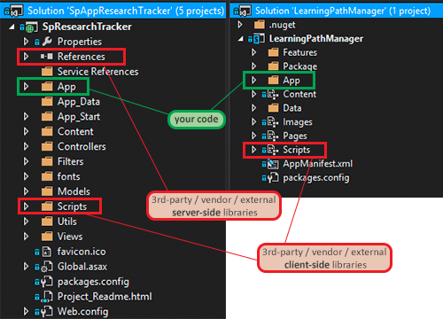

Overview
========
- [SharePoint-Hosted Apps](#sharepoint-hosted-apps)
- [Single Page Apps](#single-page-apps)
- [Thinking Ahead...](#thinking-ahead)

SharePoint-Hosted Apps
======================
All resources required to implemented app stored in an AppWeb & served up by SharePoint

Single Page Apps
================
One page, multiple screens yet no traditional page refreshes

Why Build Single Page Apps (SPAs)?
----------------------------------
- Reduced round tripping to the server
- Works great in low bandwidth & offline
- Highly interactive

Characteristics of Single Page Apps?
------------------------------------
- Routing & navigation
- Page history
- Deep linking
- Templated views & data binding

Why SharePoint hosted Apps as SPAs?
-----------------------------------
- Minimal additional deployment steps (*sort of*)
- **No extra costs** & concerns
- SPA's yield a **richer user experience**
- SPA's facilitate **modular app development**
- Leverage SharePoint for services & data storage

Organizing your Project
-----------------------
- Put all JavaScript libraries / vendor scripts in `/Scripts`
  - Just like `References` is for server side assemblies
- Put your custom JavaScript in `/App`

  

  *Why?* Because you don't want to mix your custom code with scripts & libraries with

  *Recommendation:* Look at [John Papa's](http://www.twitter.com/john_papa) [AngularJS style guide](https://github.com/johnpapa/angularjs-styleguide), specifically the section on [application structure](https://github.com/johnpapa/angularjs-styleguide#application-structure)

DEMO
----

Thinking Ahead...
=================
- Challenging stuff
- Cool techniques

Challenging stuff
-----------------
- SharePoint creates a new AppWeb & throws away the old one when updating the app
  - Storing app data in AppWeb's lists/libraries? **You'll lose it all on updates!**
- Handling app authentication (tokens)
  - **DO NOT RETURN OAUTH ACCESS TOKENS TO CLIENT**
  - May need an intermediary (*see Research Project Code Sample in **Resources** section for example*)

Cool techniques
---------------
- Use Google Analytics & virtual page views & custom events to track app usage
- Externalize JavaScript & CSS references to a CDN
  - Enables app updates without actually updating the SharePoint app
  - Doesn't help with new views
- Utilize A/B testing to see what UX works better for your users
  - Combined with Google Analytics => killer customer service offered to your customers
- Use SharePoint workflows to protect sensitive business logic
  - If server-side code needed, have workflow call it... app never sees where it went / came from
- Use BCS External Lists to hide where external data came from

#Resources (1)
- **[AngularJS](https://angularjs.org/)**
- **[AngularJS in 20 Minutes](https://www.youtube.com/watch?v=tnXO-i7944M)** - from [ng-conf](http://www.ng-conf.org/)
- [John Papa's **angularjs-styleguide** project ](https://github.com/johnpapa/angularjs-styleguide)
- [BreezeJS](http://www.breezejs.com)
- [AC's SharePoint 2013 SPA Templates](http://aconn.me/SphSpaTemplates)

#Resources (2) - Pluralsight on-demand courses
- [AngularJS Fundamentals](http://pluralsight.com/training/Courses/TableOfContents/angularjs-fundamentals) - by Joe Eames
- [Building Apps with Angular & Breeze Part 1](http://pluralsight.com/training/Courses/TableOfContents/build-apps-angular-breeze) & [Part 2](http://pluralsight.com/training/Courses/TableOfContents/build-apps-angular-breeze-part2) - by John Papa
- [Building SharePoint Apps as Single Page Apps with AngularJS](http://pluralsight.com/training/Courses/TableOfContents/building-sharepoint-apps-spa-angularjs) - by Andrew Connell

#Resources (3) - Sample SharePoint SPA Projects
- [OfficeDev - Learning Path Manager Code Sampel](https://github.com/OfficeDev/Learning-Path-Manager-Code-Sample) by Andrew Connell (*same as this one*)
- [OfficeDev - Research Project Code Sample](https://github.com/OfficeDev/Research-Project-Code-Sample) by Andrew Connell & [Scot Hillier](http://www.twitter.com/scothillier)
- [OfficeDev - SP Angular Expense Manager Code Sample](https://github.com/OfficeDev/SP-AngularJS-ExpenseManager-Code-Sample) by Dan Wahlin 